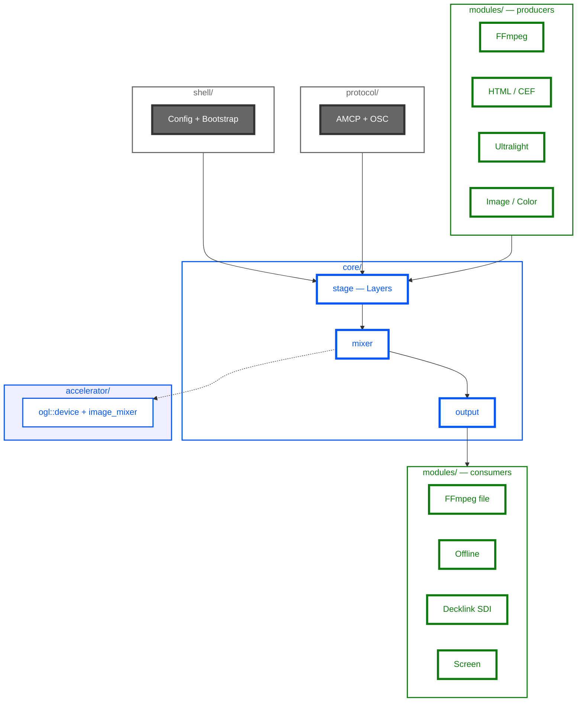
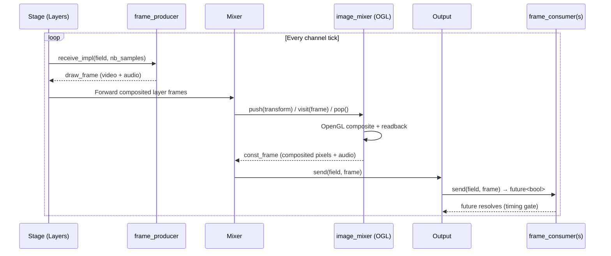
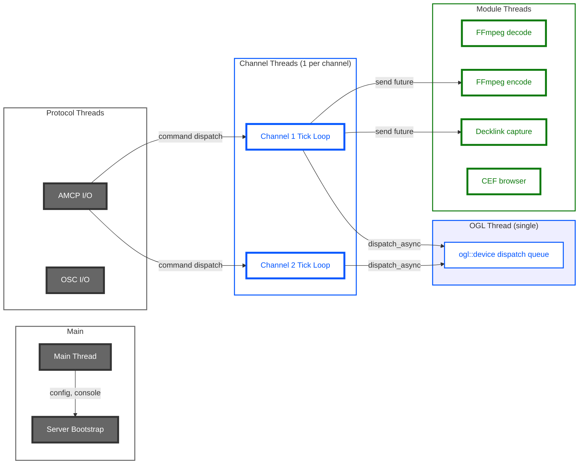
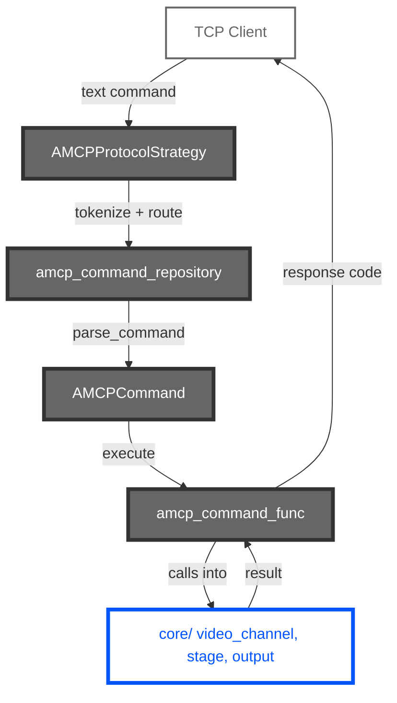
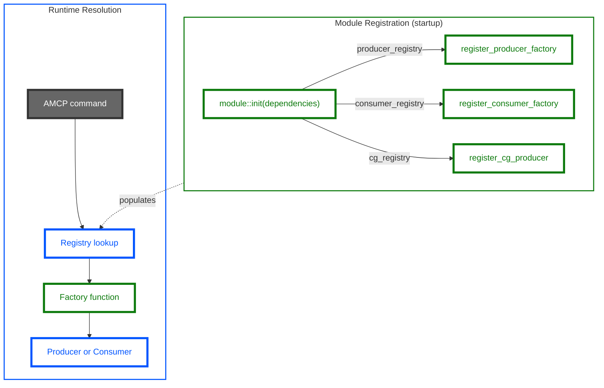
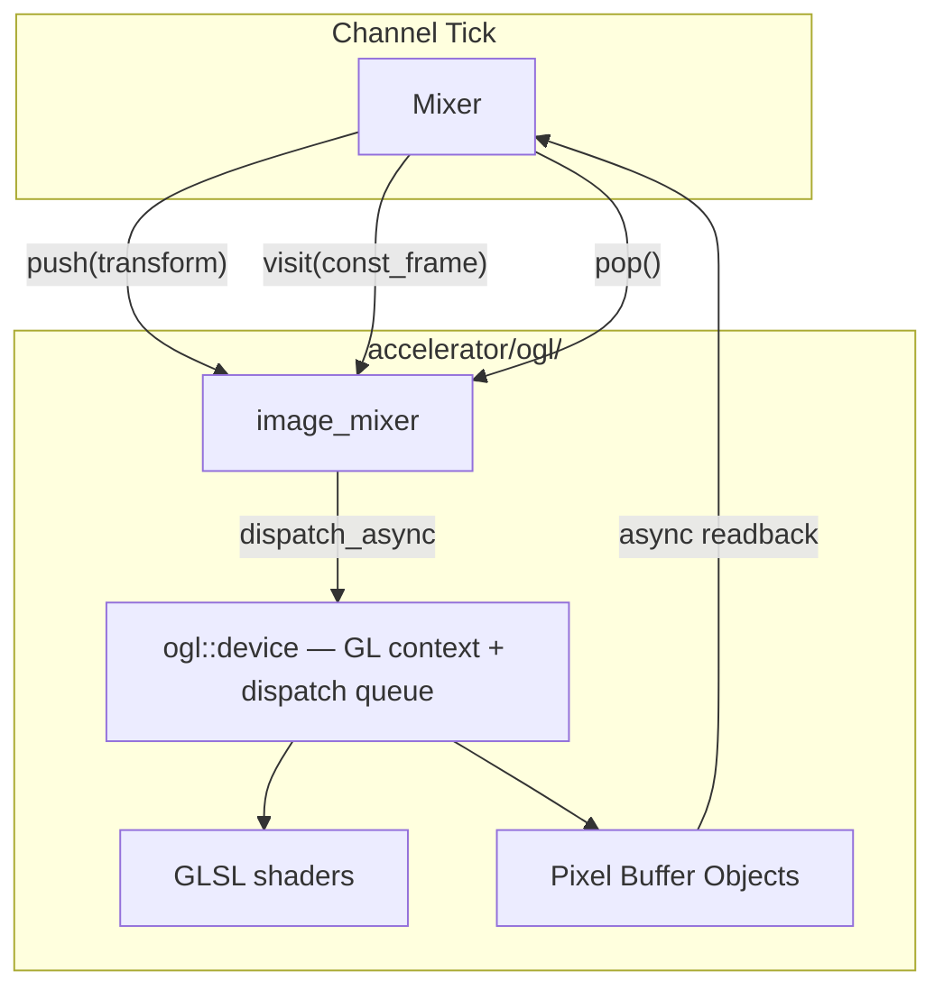
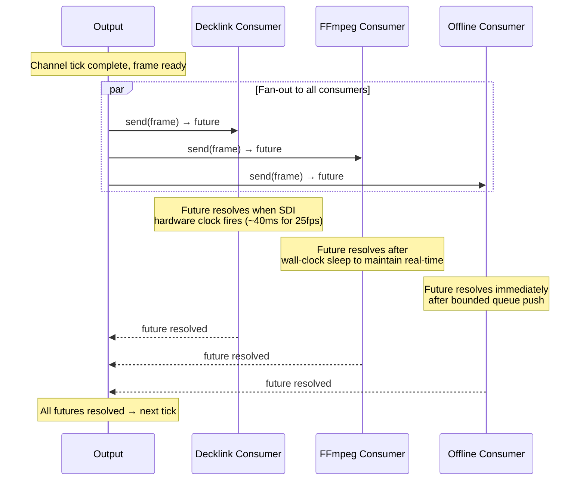
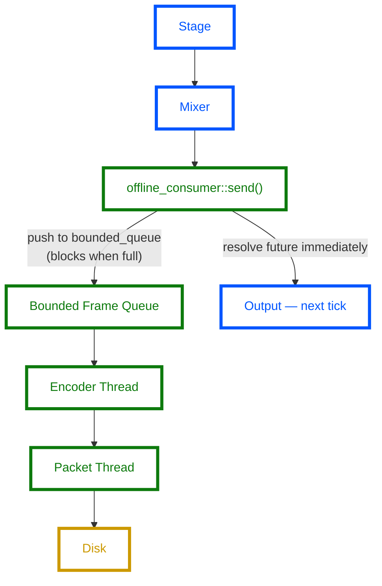
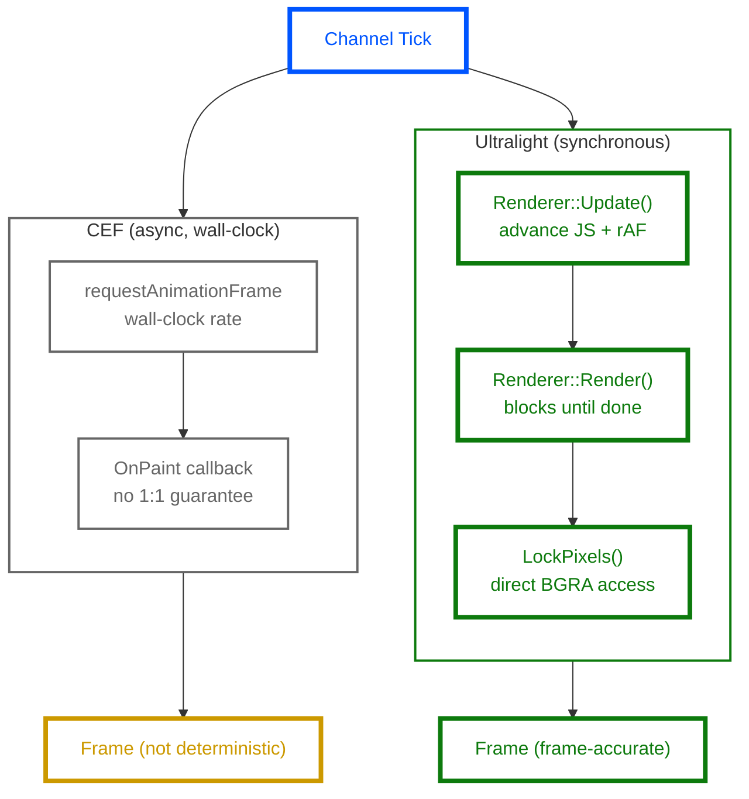
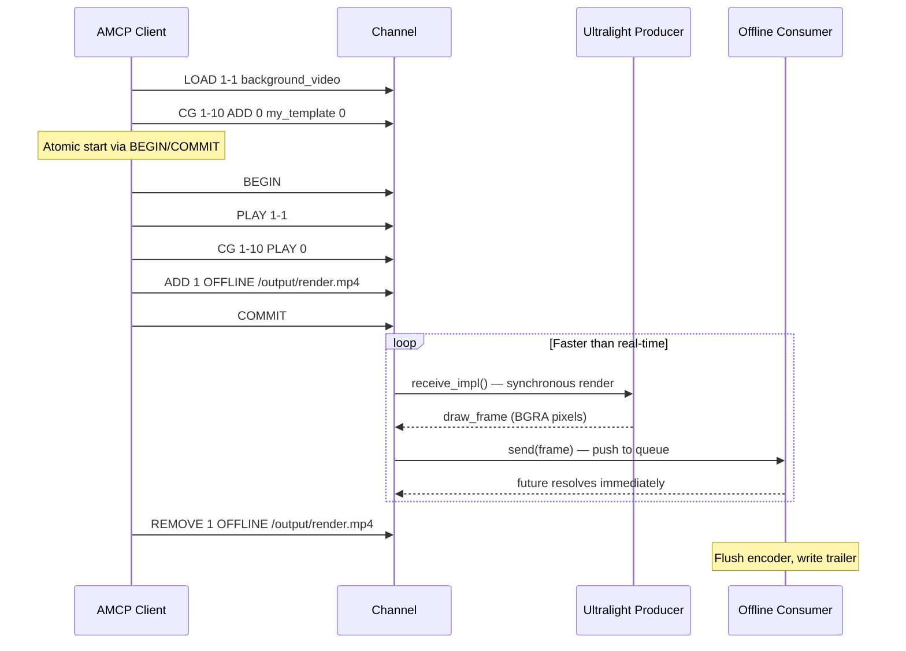

# CasparCG Server Architecture

<!-- Copyright (c) Den Frie Vilje (hej@denfrievilje.dk) -->

This document describes the internal architecture of CasparCG Server, a
professional broadcast video playout system. It is intended for developers who
want to understand, extend, or contribute to the codebase.

---

## Table of Contents

1. [High-Level Architecture](#1-high-level-architecture)
2. [Frame Pipeline](#2-frame-pipeline)
3. [Threading Model](#3-threading-model)
4. [AMCP Protocol](#4-amcp-protocol)
5. [Module System](#5-module-system)
6. [OpenGL Accelerator](#6-opengl-accelerator)
7. [Video Format System](#7-video-format-system)
8. [Consumer-Driven Timing](#8-consumer-driven-timing)
9. [Key Design Patterns](#9-key-design-patterns)
10. [Den Frie Vilje Additions](#10-den-frie-vilje-additions)

---

## 1. High-Level Architecture

CasparCG Server is organised into six top-level source directories, each with a
well-defined responsibility boundary.



### Directory responsibilities

| Directory       | Purpose                                                    |
|-----------------|------------------------------------------------------------|
| `shell/`        | Application startup, XML config parsing, server lifecycle  |
| `protocol/`     | AMCP command parsing, dispatch, OSC state feedback         |
| `core/`         | Channel, stage, mixer, output, frame and format types      |
| `accelerator/`  | OpenGL GPU compositing via `ogl::device`                   |
| `modules/`      | All producers and consumers (FFmpeg, Decklink, HTML, etc.) |
| `common/`       | Threading primitives, logging, memory, exception utilities |

### Key source files

| File                                        | Role                          |
|---------------------------------------------|-------------------------------|
| `core/video_channel.h`                      | Channel orchestration         |
| `core/producer/frame_producer.h`            | Producer interface            |
| `core/consumer/frame_consumer.h`            | Consumer interface            |
| `core/consumer/output.h`                    | Output distributes to consumers |
| `core/producer/stage.h`                     | Layer management              |
| `core/mixer/mixer.h`                        | Frame mixing                  |
| `core/frame/frame.h`                        | Frame data structures         |
| `accelerator/ogl/image/image_mixer.h`       | GPU compositor                |
| `protocol/amcp/amcp_command_repository.h`   | Command registry              |
| `common/executor.h`                         | Thread executor (MPSC)        |

---

## 2. Frame Pipeline

Every video channel runs a continuous frame production loop. Each tick of the
loop produces one output frame by pulling data through the pipeline.



### Stage

The stage manages an ordered set of **layers** (indexed 0..N). Each layer holds
a foreground producer and optional background producer (for `LOADBG`/`PLAY`
transitions). On each tick the stage calls `receive_impl()` on every active
layer's producer and collects the resulting `draw_frame` objects.

### Mixer

The mixer receives the per-layer frames and delegates GPU compositing to the
`image_mixer`. It also handles audio mixing (channel layout, volume). The output
is a single `const_frame` containing the final BGRA pixels and interleaved
audio.

### Output

The output module fans out each composited frame to all registered consumers.
It calls `send()` on every consumer, collecting the returned `std::future<bool>`
objects, and waits on all of them before allowing the next tick. This is the
timing gate described in [Consumer-Driven Timing](#8-consumer-driven-timing).

---

## 3. Threading Model

CasparCG uses dedicated threads for different subsystems to avoid blocking
the frame pipeline.



### Thread roles

| Thread(s)         | Responsibility                                       |
|-------------------|------------------------------------------------------|
| Main              | Configuration parsing, console I/O, signal handling  |
| Channel (N)       | Frame production loop: stage tick, mix, output send  |
| OGL (1)           | All OpenGL calls via `ogl::device` dispatch queue    |
| AMCP / OSC        | Network I/O and command parsing (boost::asio)        |
| FFmpeg decode     | Demuxing and decoding source media                   |
| FFmpeg encode     | Encoding output frames (ffmpeg/offline consumers)    |
| Decklink capture  | SDI input callback thread (hardware-driven)          |
| CEF               | Chromium browser process and rendering               |

### executor (common/executor.h)

Most CasparCG threads are built on the `executor` class, which implements a
single-consumer, multi-producer (MPSC) task queue. This allows any thread to
post work to a specific executor and optionally wait on the result via a
returned `std::future`.

The OGL device uses this pattern: channel threads post GL operations via
`dispatch_async()` or `dispatch_sync()`, and the single OGL thread processes
them sequentially, ensuring thread-safe access to the GL context.

---

## 4. AMCP Protocol

AMCP (Advanced Media Control Protocol) is the primary control interface. Clients
connect via TCP and send text commands.



### Command lifecycle

1. **Parse**: `AMCPProtocolStrategy` receives a line of text, tokenizes it, and
   looks up the command verb in the `amcp_command_repository`.
2. **Build**: `parse_command()` returns an `AMCPCommand` object bound to a
   specific `amcp_command_func` implementation and its parsed parameters.
3. **Execute**: The command function runs, interacting with the core domain
   (channels, stages, outputs).
4. **Respond**: The function returns a response code (e.g. `202 OK`) and
   optional data, which is sent back to the client.

### Example commands

```
PLAY 1-10 my_video LOOP
CG 1-20 ADD 0 my_template 1 "{\"title\": \"Hello\"}"
ADD 1 DECKLINK 1
ADD 1 OFFLINE /output/render.mp4 -codec:v libx264
REMOVE 1 OFFLINE /output/render.mp4
```

### Key source files

- `protocol/amcp/amcp_command_repository.h` -- command registration and lookup
- `protocol/amcp/AMCPProtocolStrategy.h` -- TCP line protocol handling
- `protocol/amcp/AMCPCommandsImpl.cpp` -- built-in command implementations

---

## 5. Module System

Modules are the plugin mechanism for producers and consumers. Each module
registers its factories at startup via dependency injection.



### Registration API

```cpp
// Producer factory
dependencies.producer_registry->register_producer_factory(
    L"FFmpeg", create_producer);

// Consumer factory
dependencies.consumer_registry->register_consumer_factory(
    L"Decklink", create_consumer);

// CG (template) producer with file extension binding
dependencies.cg_registry->register_cg_producer(
    L"html", {L".html"}, create_cg_proxy, create_producer);
```

### Built-in modules

| Module      | Producers                        | Consumers                   |
|-------------|----------------------------------|-----------------------------|
| FFmpeg      | Video/audio file, stream input   | File output, streaming      |
| Decklink    | SDI input                        | SDI output                  |
| HTML (CEF)  | HTML template rendering          | --                          |
| Ultralight  | HTML template rendering (sync)   | --                          |
| Screen      | --                               | Window preview output       |
| Offline     | --                               | Faster-than-real-time file  |

---

## 6. OpenGL Accelerator

The accelerator provides GPU-based frame compositing via OpenGL. It is
decoupled from the core through the `image_mixer` interface.



### Visitor pattern compositing

The mixer drives the image_mixer through a three-method visitor interface:

1. **`push(frame_transform)`** -- push a transform context onto the stack
   (opacity, geometry, crop, perspective, chroma key, levels).
2. **`visit(const_frame)`** -- render the frame's texture using the current
   accumulated transform.
3. **`pop()`** -- pop the transform context.

This allows the mixer to walk the layer tree depth-first while the image_mixer
translates each visit into OpenGL draw calls.

### Frame transforms

| Property         | Description                                    |
|------------------|------------------------------------------------|
| `opacity`        | Layer transparency (0.0 -- 1.0)                |
| `fill_translation` / `fill_scale` | Geometry placement and scaling  |
| `clip_translation` / `clip_scale` | Clipping rectangle              |
| `crop`           | Source cropping (left, top, right, bottom)      |
| `perspective`    | 4-corner pin for perspective distortion         |
| `chroma`         | Chroma key settings (hue, threshold, softness)  |
| `levels`         | Black/white levels, gamma                       |
| `is_key`         | Use this layer as alpha key for the layer above |

### ogl::device

The `ogl::device` owns the single OpenGL context and exposes a task queue:

- **`dispatch_async(func)`** -- post a GL task, return future
- **`dispatch_sync(func)`** -- post a GL task, block until complete

All OpenGL calls in the application are funneled through this device. Channel
threads never call GL directly; they post work and wait on futures. This
eliminates GL context threading issues.

---

## 7. Video Format System

CasparCG supports a wide range of broadcast video formats, described by the
`video_format_desc` structure.

**`video_format_desc` fields:**

| Field           | Type         | Description                                 |
|-----------------|--------------|---------------------------------------------|
| `width`         | int          | Horizontal resolution                       |
| `height`        | int          | Vertical resolution                         |
| `field_count`   | int          | 1 (progressive) or 2 (interlaced)           |
| `fps`           | double       | Frames per second                           |
| `hz`            | double       | Fields per second (= fps x field_count)     |
| `framerate`     | rational     | Exact fraction (e.g. 30000/1001)            |
| `audio_cadence` | vector\<int> | Repeating per-frame sample counts           |

**Supported formats:**

| Family   | Resolutions              | Frame rates                    |
|----------|--------------------------|--------------------------------|
| SD       | 720x576i, 720x486i       | PAL 25, NTSC 29.97            |
| 720p     | 1280x720                 | 50, 59.94                     |
| 1080i    | 1920x1080                | 25, 29.97                     |
| 1080p    | 1920x1080                | 23.98, 24, 25, 29.97, 50, 59.94 |
| 2160p    | 3840x2160                | 23.98, 24, 25, 29.97, 50, 59.94 |
| 4K DCI   | 4096x2160                | 23.98, 24, 25                 |

### Interlaced vs. progressive

- **Progressive** (`field_count = 1`): each tick produces a full frame.
- **Interlaced** (`field_count = 2`): each tick produces one field. The producer
  receives a `video_field` parameter indicating upper or lower field. The mixer
  and consumers handle field interleaving.

### Audio cadence

For formats where the video frame rate does not divide evenly into the audio
sample rate (e.g. 29.97fps at 48kHz), `audio_cadence` provides a repeating
pattern of per-frame sample counts. For example, NTSC 29.97fps uses a 5-frame
cadence of `{1602, 1601, 1602, 1601, 1602}` samples, averaging to 48048 samples
per 30/1.001 seconds.

### Pixel formats

The `pixel_format` enum describes frame pixel layout:

| Format      | Description                          |
|-------------|--------------------------------------|
| `gray`      | 8-bit luminance                      |
| `bgra`      | 32-bit packed BGRA (GPU native)      |
| `rgba`      | 32-bit packed RGBA                   |
| `ycbcr`     | Planar YCbCr (420, 422, or 444)      |
| `ycbcra`    | Planar YCbCr + alpha                 |

Producers typically emit `bgra` frames. The image_mixer works natively in BGRA.
FFmpeg producers may emit `ycbcr` which the mixer converts via shader.

---

## 8. Consumer-Driven Timing

This is one of the most important architectural concepts in CasparCG and is
critical to understanding offline rendering.



### How timing works

The `output` module calls `send()` on every registered consumer and collects
the returned `std::future<bool>` objects. It then **waits on all futures**
before permitting the next channel tick.

This means the **slowest consumer determines the channel tick rate**.

### Real-time: Decklink

The Decklink consumer's future resolves when the SDI hardware fires its frame
completion interrupt. The hardware clock runs at exactly the format rate (e.g.
25 Hz for PAL). This locks the entire pipeline to broadcast-accurate real-time.

### Real-time: FFmpeg

The FFmpeg consumer uses a wall-clock sleep to pace output. If encoding is
faster than real-time, it sleeps to fill the gap. If encoding is slower, frames
may be dropped.

### Offline: Faster than real-time

The offline consumer's future resolves **immediately** after pushing the frame
onto a bounded queue. There is no wall-clock synchronisation. The channel ticks
as fast as:

- The producers can decode source media
- The GPU can composite
- The encoder thread can drain the bounded queue

When the queue is full, `send()` blocks (backpressure), naturally throttling
the pipeline to the slowest component. The offline consumer also returns
`has_synchronization_clock() = true` to suppress the output module's fallback
wall-clock sleep.

---

## 9. Key Design Patterns

### Visitor (image_mixer compositing)

The image_mixer interface uses the visitor pattern for GPU compositing.
The mixer walks the layer tree calling `push()`, `visit()`, and `pop()`,
while the image_mixer translates this traversal into OpenGL operations.
This decouples the layer structure from the rendering implementation.

### Factory (producer/consumer registries)

Modules register factory functions at startup. At runtime, AMCP commands trigger
registry lookups that invoke the matching factory to create producer or consumer
instances. This allows new formats and devices to be added without modifying
the core.

### Pimpl (stage, mixer, output)

Core classes use the pimpl (pointer-to-implementation) idiom to hide
implementation details behind a stable ABI. The public headers expose only the
interface; the `_impl` classes in `.cpp` files contain the actual state and
logic.

### Async / Futures

GPU rendering and consumer output use `std::future` extensively. Channel
threads post work to the OGL device and consumers, then wait on the returned
futures. This enables pipelining (the GPU can composite frame N+1 while
consumers process frame N) and provides natural backpressure.

### Signal / Slot (route_signal)

CasparCG uses signal/slot for frame distribution in special cases like the
`route` producer, which subscribes to another channel's output signal to
receive frames. This enables channel-to-channel routing without polling.

### Monitor / State (hierarchical diagnostics)

The monitor system collects hierarchical runtime state (buffer levels, frame
rates, consumer status) that is exposed via OSC and the diagnostic display.
Each component publishes its state to a `monitor::state` tree.

### Executor (MPSC task queue)

The `executor` class in `common/` implements a multi-producer, single-consumer
task queue. It is the fundamental building block for CasparCG's threading model,
used by the OGL device, channel ticks, and various module threads.

---

## 10. Den Frie Vilje Additions

Den Frie Vilje has contributed two components that work together to enable
deterministic faster-than-real-time rendering.

### Offline Consumer

The offline consumer renders CasparCG output to file without real-time
constraints. The channel pipeline runs as fast as the CPU and GPU allow,
throttled only by backpressure from a bounded frame queue.



Key design decisions:

- **`has_synchronization_clock() = true`**: suppresses the output module's
  fallback wall-clock sleep, allowing the channel to tick without delay.
- **Bounded queue backpressure**: the queue depth (default 4) is the sole
  tuning parameter. When full, `send()` blocks, stalling the pipeline
  naturally.
- **Frame-accurate start**: use AMCP `BEGIN`/`COMMIT` batching to atomically
  start playback and the consumer on the same channel tick.

See [offline-rendering.md](offline-rendering.md) for AMCP usage and
performance benchmarks.

### Ultralight HTML Producer

The Ultralight producer is a synchronous HTML renderer that replaces CEF for
offline rendering workflows. CEF renders asynchronously on its own wall-clock
timer, which limits offline throughput to approximately 1x real-time and causes
frame drift. Ultralight provides a synchronous rendering API where one call
to `receive_impl()` produces exactly one fresh frame.



Key properties:

- **Synchronous**: `Update()` then `Render()` on every channel tick. No
  internal clock, no async compositor.
- **CG compatible**: same CG protocol as CEF (`play()`, `stop()`, `update()`,
  `next()`, `remove()`). Templates work unchanged.
- **Optional build**: `ENABLE_ULTRALIGHT=OFF` by default. The Ultralight SDK
  is proprietary and not bundled.

See [ultralight-producer.md](ultralight-producer.md) for build instructions,
template compatibility details, and known limitations.

### Combined workflow

The offline consumer and Ultralight producer are designed to work together:



This produces a frame-accurate file render at 1.5x real-time for content with
Ultralight HTML overlays (tested in Docker with software GL). Video-only
renders at 2.3x. CEF templates also run at 1.5x but are not deterministic
(overlay frames are duplicated/skipped). Native Linux with GPU will be faster.

---

## Source file index

For quick navigation, here are the most important files grouped by subsystem.

### Core

| File | Purpose |
|------|---------|
| `core/video_channel.h` | Channel lifecycle and component wiring |
| `core/producer/stage.h` | Layer management, producer ticking |
| `core/producer/frame_producer.h` | Producer interface (`receive_impl`) |
| `core/consumer/output.h` | Consumer fan-out and timing gate |
| `core/consumer/frame_consumer.h` | Consumer interface (`send`) |
| `core/mixer/mixer.h` | Audio + video mixing orchestration |
| `core/frame/frame.h` | Frame data: pixels, audio, metadata |
| `core/video_format.h` | Format descriptors and enumerations |

### Accelerator

| File | Purpose |
|------|---------|
| `accelerator/ogl/image/image_mixer.h` | GPU compositor (visitor interface) |
| `accelerator/ogl/util/device.h` | OpenGL context and dispatch queue |

### Protocol

| File | Purpose |
|------|---------|
| `protocol/amcp/amcp_command_repository.h` | Command registration and lookup |
| `protocol/amcp/AMCPProtocolStrategy.h` | TCP line protocol handler |

### Common

| File | Purpose |
|------|---------|
| `common/executor.h` | MPSC task queue — threading primitive |
| `common/diagnostics/graph.h` | Performance diagnostics |

### Den Frie Vilje modules

| File | Purpose |
|------|---------|
| `modules/ffmpeg/consumer/offline_consumer.cpp` | Offline consumer |
| `modules/ultralight/producer/ultralight_producer.cpp` | Synchronous HTML renderer |
| `modules/ultralight/producer/ultralight_cg_proxy.cpp` | CG command mapping |
